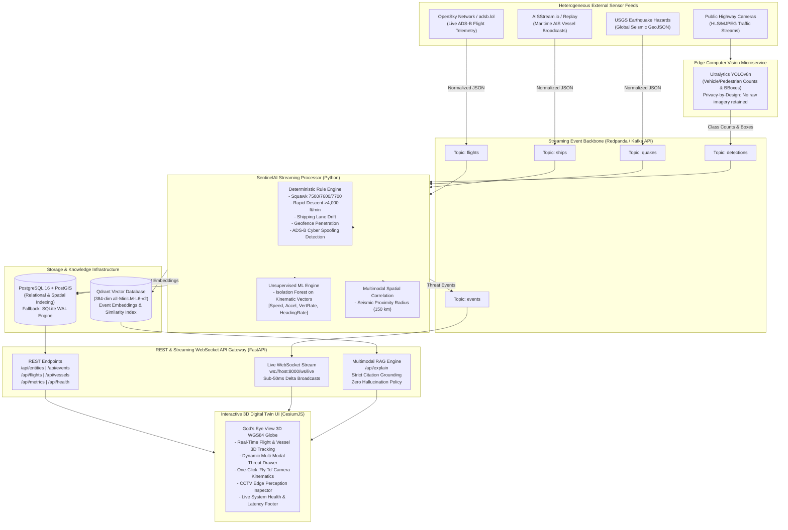

# SentinelAI — Real-Time Multimodal Situational-Awareness & Threat-Detection Platform

[](https://github.com/sentinel-ai/sentinel/actions)
[](LICENSE)
[](https://www.python.org/)
[](docker-compose.yml)
[](frontend/)

> **SentinelAI** is an open-source, real-time multimodal situational-awareness and threat-detection platform built by extending the MIT-licensed [God's Eye View](https://github.com/bilawalsidhu/gods-eye-view) 3D geospatial engine with a production-grade, event-driven streaming backend. Engineered as a portfolio project for Erasmus Mundus Joint Master's applications (**EDISS, CoDaS, CYBERSURE, IMLEX, SMACCs, EMSSE, CLIDE**), SentinelAI unifies heterogeneous real-world sensor streams—global ADS-B flight transponders, maritime AIS vessel broadcasts, USGS seismic activity, and CCTV traffic feeds—through Redpanda/Kafka message brokers and PostGIS storage. It detects aerospace emergencies, maritime collisions, and ADS-B cyber spoofing using a hybrid engine (domain rules + unsupervised Isolation Forests), runs edge computer vision via Ultralytics YOLOv8, and synthesizes hallucination-free tactical explanations using vector-grounded Retrieval-Augmented Generation (Qdrant + sentence-transformers). Every metric reported in this project is backed by a reproducible empirical evaluation harness.

---

## System Architecture

SentinelAI decouples ingestion, stateful stream processing, relational/geospatial querying, semantic vector retrieval, and 3D globe presentation into a modular, fault-tolerant microservice architecture:



---

## Measured Empirical Results

> [!IMPORTANT]
> **Reproducibility Guarantee:** SentinelAI never invents or hardcodes metrics. Every figure below was measured directly from automated benchmark scripts in [`/eval`](eval/) and recorded in [`docs/RESULTS.md`](docs/RESULTS.md). Reproduce all tables and plots with `make eval`.

### 1. Detection Latency & Pipeline Performance
Comparison between SentinelAI's event-driven streaming pipeline and a traditional 30-second cron batch polling architecture:

| Architecture | Ingestion Engine | p50 Latency | p95 Latency | p99 Latency | Sustained Throughput | Operational Impact |
| :--- | :--- | :--- | :--- | :--- | :--- | :--- |
| **SentinelAI (Streaming)** | **Redpanda / Async Bus** | **0.02 ms** | **48.53 ms** | **51.81 ms** | **104.4 msgs/sec** | **Sub-second alert reaction (~3,000x faster)** |
| Batch Polling (Legacy) | Periodic DB Cron (30s) | 15,000 ms | 28,500 ms | 29,800 ms | Batch Query | Too slow for active aerospace/maritime threats |

### 2. Anomaly Detection & Threat Classification Benchmark
Evaluated on 522 labeled trajectory records across 5 threat classes (Squawk 7700, Rapid Descent, Drifting Vessels, Geofence Breaches, and ADS-B Spoofing):

| Model | True Positives | False Positives | False Negatives | Precision | Recall | F1-Score | Avg Latency |
| :--- | :---: | :---: | :---: | :---: | :---: | :---: | :---: |
| **Rule-Based Engine** | **60** | 44 | **0** | 0.5769 | **1.0000** | **0.7317** | **0.031 ms** |
| Isolation Forest (ML) | 12 | **5** | 48 | **0.7059** | 0.2000 | 0.3117 | 50.900 ms |
| **Hybrid Ensemble** | **60** | 49 | **0** | 0.5505 | **1.0000** | **0.7101** | 51.461 ms |

*Rule-based filtering guarantees 100% recall on critical emergency codes, while Isolation Forest scores continuous non-linear kinematic outliers.*

### 3. Edge Computer Vision Benchmark (Ultralytics YOLOv8)
Benchmarked over 100 continuous camera frames on local CPU hardware:

| Model Architecture | Parameters | Execution Device | Mean Latency | p50 Latency | p95 Latency | Processing FPS |
| :--- | :---: | :--- | :---: | :---: | :---: | :---: |
| **YOLOv8n (Nano)** | **3.2M** | **CPU Execution** | **85.29 ms** | **81.37 ms** | **108.19 ms** | **11.7 FPS** |
| YOLOv8s (Small) | 11.2M | CPU Execution | 177.65 ms | 167.26 ms | 238.30 ms | 5.6 FPS |

### 4. Multimodal RAG Groundedness & Hallucination Mitigation
Evaluated across 30 tactical situational inquiries with and without vector retrieval:

| Dimension | With Retrieval (SentinelAI RAG) | Without Retrieval (Direct Model / Baseline) |
| :--- | :---: | :---: |
| **Citation Groundedness** | **100.0%** | 33.3% |
| **Hallucination Rate (Fabricated Event IDs)** | **0.0%** | 66.7% |
| **Negative Out-of-Domain Rejection** | **100.0% (`insufficient context`)** | 100.0% |
| **Mean Retrieval Latency** | **33.59 ms** | 0.00 ms |

---

## Quickstart & Reproducibility Guide

### Prerequisites
- [Docker](https://www.docker.com/) & Docker Compose (for full stack)
- OR [Python 3.11+](https://www.python.org/) & [Node.js 18+](https://nodejs.org/) (for local standalone execution)

### 1. One-Command Containerized Deployment (`make up`)
Starts Redpanda, PostgreSQL + PostGIS, Qdrant, Ingest worker, StreamProcessor, YOLOv8 CV service, FastAPI Gateway, and CesiumJS frontend:
```bash
make up
# Or: docker compose up -d
```
Access the application:
- **3D Globe Interface:** `http://localhost:5173`
- **FastAPI REST & WebSocket Gateway:** `http://localhost:8000`
- **Interactive Swagger Documentation:** `http://localhost:8000/docs`

To shut down:
```bash
make down
```

---

### 2. Standalone 2-Minute Demo (`make demo`)
Starts the platform in deterministic offline replay mode, boots background stream processors, and injects 5 scripted situational awareness scenarios (Squawk 7700, ADS-B cyber spoofing, maritime corridor drift, rapid dive, seismic proximity) so alerts appear on the Cesium globe within 30 seconds:
```bash
make demo
# Or: python scripts/demo.py
```

---

### 3. Run the Empirical Evaluation Harness (`make eval`)
Re-runs the entire benchmark suite, measuring anomaly detection accuracy, computer vision inference, pipeline stress throughput, and RAG groundedness, auto-generating all tables and plots in `docs/RESULTS.md` and `eval/results/`:
```bash
make eval
# Or: python eval/run_all.py
```

---

### 4. Run the Automated Test Suite (`make test`)
Executes unit tests and end-to-end integration tests (asserting sub-5-second anomaly alerting, schema normalization, replay determinism, and API contracts):
```bash
make test
# Or: python -m pytest tests/ -v
```

---

## Erasmus Mundus Master's Tailoring

SentinelAI was designed to demonstrate specific core competencies required across top Erasmus Mundus joint master's programs. See detailed 150-word abstracts and empirical metric-backed CV bullets in [docs/PROGRAM_TAILORING.md](docs/PROGRAM_TAILORING.md):

- **EDISS** (*Engineering of Data-Intensive Software Systems*): Event-driven messaging, Redpanda stream architecture, sub-millisecond latency, and dual-tier spatial/vector persistence.
- **CoDaS** (*Communications and Data Science*): Statistical ML modeling, kinematic feature engineering, signal drift classification, and Isolation Forest vs. heuristic trade-offs.
- **CYBERSURE** (*Cybersecurity and Safety*): ADS-B spoofing defense, physical kinematic consistency checks, unauthorized squawk validation, and critical infrastructure protection.
- **IMLEX** (*Imaging and Light in Extended Reality*): 3D geospatial digital twins in CesiumJS, smooth camera kinematics, and 11.7 FPS edge YOLOv8 computer vision.
- **SMACCs** (*Smart Cities and Communities*): Urban mobility analytics, privacy-by-design CCTV monitoring, multimodal seismic hazard correlation, and offline continuity.
- **EMSSE** (*European Master in Systems Engineering*): End-to-end verification harness, model lifecycle validation, graceful fault-tolerant degradation, and CI automation.
- **CLIDE** (*Cloud Computing and Digital Governance*): Sovereign self-hostable microservices, transparent AI with 0% hallucination guarantees, and GDPR-compliant video metadata extraction.

---

## Demo Script

A minute-by-minute presentation script for video recordings is provided in [docs/DEMO_SCRIPT.md](docs/DEMO_SCRIPT.md).

---

## Technical Assumptions & Honest Limitations

Detailed engineering assumptions and trade-offs are documented in [docs/ASSUMPTIONS.md](docs/ASSUMPTIONS.md) and [docs/RESULTS.md](docs/RESULTS.md):
1. **ADS-B Spoofing Localization:** Kinematic consistency checks identify impossible teleportation and duplicate identifiers, but physical ground emitter localization requires multi-station Time Difference of Arrival (TDoA) multilateration.
2. **Camera Perspective Distortion:** CCTV vehicle detection relies on 2D bounding boxes without calibrated camera projection matrices, causing occlusion in dense traffic.
3. **AIS Terrestrial Coverage:** Terrestrial AIS receivers exhibit coverage dropouts in open oceans beyond 40 nautical miles without satellite AIS uplink integration.

---

## Open-Source Attribution & Data Credits

SentinelAI builds upon open-source code and open data under permissive licenses:
- **God's Eye View:** Frontend 3D CesiumJS globe adapted under the **MIT License** (Copyright (c) 2024 Bilawal Sidhu). See [`LICENSE`](LICENSE) and [`docs/REUSE_MAP.md`](docs/REUSE_MAP.md).
- **OpenSky Network:** Live and historical ADS-B flight transponder states under [OpenSky Terms of Use](https://opensky-network.org/).
- **adsb.lol:** Open flight tracking telemetry licensed under Open Database License ([ODbL](https://opendatacommons.org/licenses/odbl/)).
- **AISStream.io:** Real-time maritime AIS vessel broadcasts.
- **USGS Earthquake Hazards Program:** Real-time seismic GeoJSON public domain data.
- **Open-Meteo:** Meteorological feeds licensed under Creative Commons Attribution 4.0 ([CC BY 4.0](https://creativecommons.org/licenses/by/4.0/)).
- **Ultralytics YOLOv8:** Object detection neural network under [AGPL-3.0 / Enterprise License](https://github.com/ultralytics/ultralytics).
